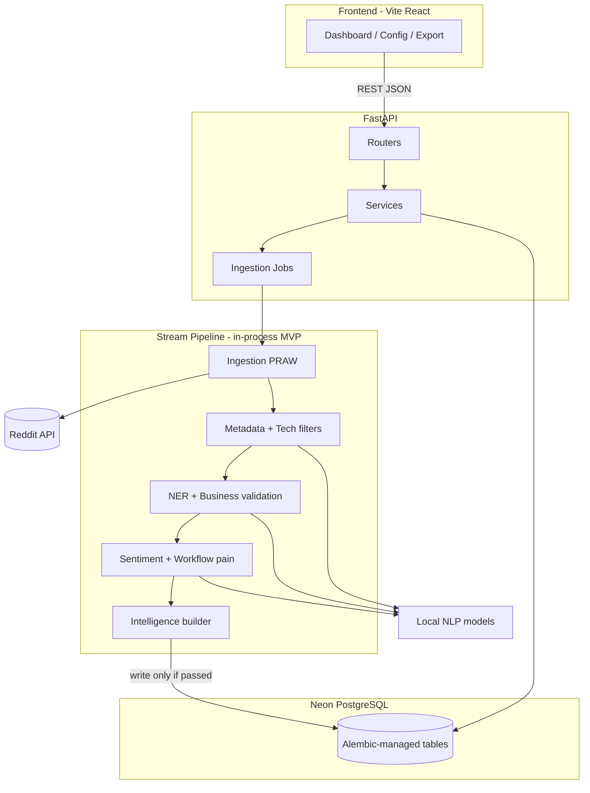

# System architecture

## High-level diagram

## Design principles

### 1. Stream-first ingestion (PDF requirement)

Posts are **not** stored on fetch. Each item flows:

`fetch → filter (cheap → expensive) → enrich → pain detect → persist OR discard`

Discarded items may be logged to a `pipeline_rejects` table (optional, for tuning) with reason codes—not full post bodies unless needed for debugging.

### 2. Modular monolith (MVP)

Single FastAPI process runs the pipeline synchronously per post (or small batch). Rationale:

- Simpler ops for MVP.
- PDF emphasizes per-post processing.
- Later: Celery/ARQ + Redis without changing domain modules.

### 3. Configuration over code for targets

`TARGET_SUBREDDITS`, thresholds, and keyword lists live in DB (`pipeline_config`) with defaults seeded from PDF—editable via API/UI without redeploy.

### 4. Intelligence as first-class artifact

Step 10 output is the **validated intelligence layer**: stable JSON schema versioned (`schema_version` field) for downstream clustering / market-gap JSON (future phase beyond PDF page 10).

## Backend layers

| Layer | Responsibility |
|-------|----------------|
| `api/` | HTTP, validation (Pydantic), auth later |
| `services/` | Orchestration: start run, query intelligence |
| `ingestion/` | PRAW client, subreddit iterators, rate limits |
| `filtering/` | Steps 3–5: length, votes, recency, keywords, classifier |
| `enrichment/` | Steps 6–7: product/company extraction, business rules |
| `pain/` | Steps 8–9: sentiment, workflow keyword patterns |
| `intelligence/` | Step 10: build + validate final JSON, persist |
| `db/` | SQLAlchemy 2.0 models, async session |

## Frontend role

React app is **control plane + read plane**:

- Configure subreddits and thresholds.
- Trigger/manual runs; show run status.
- Browse, filter, export intelligence JSON.
- No NLP or Reddit secrets in the browser.

## Cross-cutting concerns

| Concern | Approach |
|---------|----------|
| Logging | Structured JSON logs; `run_id`, `post_id`, `filter_stage` |
| Idempotency | Unique `reddit_post_id`; upsert or skip duplicate |
| Rate limits | PRAW backoff; configurable `limit` per subreddit per run |
| Secrets | `.env` locally; Neon/Reddit vars never committed |
| CORS | Dev: Vite `5173`; prod: deployed frontend origin |
| Health | `GET /health` liveness; `GET /health/db` Neon connectivity |

## Deployment sketch (later)

- **Backend:** container or PaaS (Fly/Railway/Render) with `uv run uvicorn`.
- **Frontend:** static build to CDN or same host behind reverse proxy.
- **Neon:** separate branches for dev/staging/prod optional.
- **Migrations:** `uv run alembic upgrade head` in release step before app start.

## Security (MVP baseline)

- Reddit credentials server-side only.
- No public write endpoints without API key (add `X-API-Key` for ingest triggers in MVP if exposed).
- Parameterized SQL via SQLAlchemy; JSON columns validated before insert.
